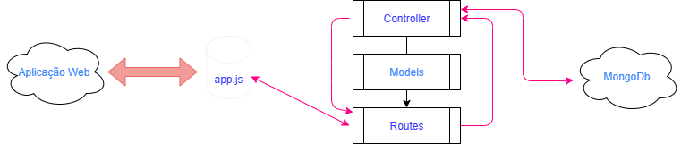

# Projeto API-Clínica-Médica    

## Objetivos:
O objetivo principal é fornecer uma interface programática para sistemas externos (como um frontend web ou mobile, ou até mesmo os testes Cypress!) poderem cadastrar, consultar e gerenciar dados de pacientes e suas anamneses. Isso centraliza os dados e permite a integração com outras aplicações.

## Público-alvo: 
Principalmente profissionais da saúde e desenvolvedores que precisem interagir com os dados da clínica, seja para construir interfaces de usuário, sistemas de relatórios ou ferramentas de automação.

***

## Cronograma parcial (Mvp1): 
Data Início: 03/06/25
Data Final: 27/06/25

***
> ## 💻 Tecnologias:
* **Linguagem:** JavaScript
* **Ambiente de Execução:** NodeJs - v22.16.0
* **Gerenciador de dependências:** Npm  - v11.4.1
* **Framework Web:** Express
* **Banco de dados:** MongoDB/Atlas
* **Interação com MongoDB (ODM):** Mongoose

***

>    ### 🛠️ **Outras ferramentas:**
    * Git     - v2.49.0
    * Postman - v11.49.0

> ## 🏢 Arquitetura da Aplicação: 

 